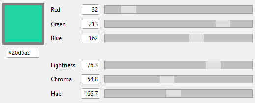

# karafuru

_karafuru_ is a lightweight color picker written in Python. It supports RGB and LCH color spaces.

## Requirements

If you'd like to run _karafuru_, you only need Python 3.5 or higher. Simply clone or download the repository and run `karafuru.py`. No third-party libraries are required at this point. (Note: Tkinter is required, and some Linux distributions will not bundle it with the rest of the Python standard libary. For example, on Debian, the required package is called `python3-tk`.)

Alternatively, if you're on Windows, check out the releases page for binary releases.

## What is LCH?

LCH (lightness, chroma and hue) is a color space that is much broader than the classic RGB color space. While we currently lack monitors to actually display all these colors that do not exist within the RGB color space, the LCH color space also makes picking colors with uniform lightness a lot easier. This is the main reason I have created _karafuru_.

## Automatic gamut correction

As stated, the LCH color space is much broader than the RGB color space. That means not all of its colors can be mapped to RGB. Therefore, _karafuru_ will automatically reduce the chroma component when picking colors inside the LCH color space, so the resulting color will fit into the RGB color space. _karafuru_ will also display a warning when the current color is being corrected.

## Credits

A big thank you and a bunch of credits go to [Lea Verou](https://github.com/LeaVerou) and [Chris Lilley](https://github.com/svgeesus). They have created [a web-based LCH color picker](https://css.land/lch/) and [color.js](https://github.com/LeaVerou/color.js), which the conversion code in _karafuru_ is derived from.
